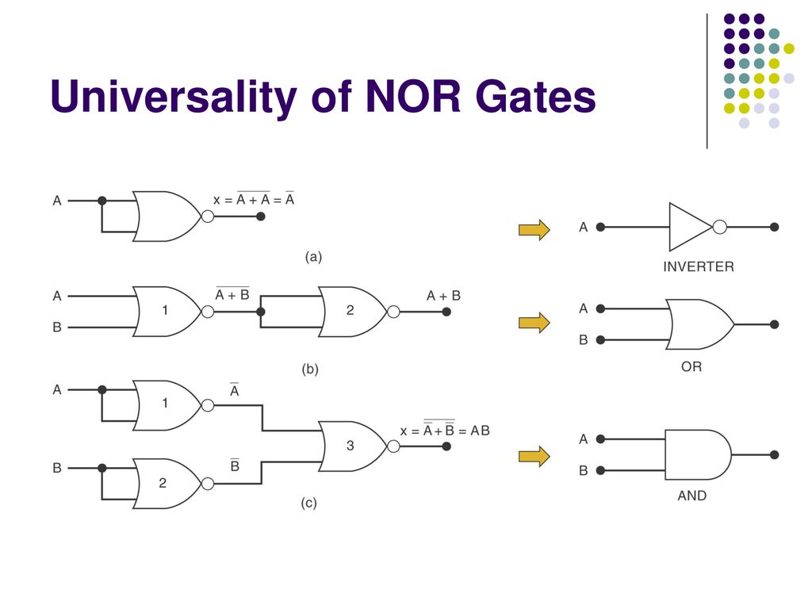

# Boolean Theorems

# Basic Logic Gates
- AND (Boolean multiplication) : Only true if both A and B are true
    - A | B | AB
      --- | --- | ---
      0 | 0 | 0
      0 | 1 | 0
      1 | 0 | 0
      1 | 1 | 1
- OR (Boolean addition) : Only true if either A or B is true
    - A | B | A + B
      --- | --- | ---
      0 | 0 | 0
      0 | 1 | 1
      1 | 0 | 1
      1 | 1 | 1
- NOT (Boolean inversion): Only true if A is false, false if A is true
    - A | A'
      --- | ---
      0 | 1
      1 | 0

There can be more than 2 inputs for AND and OR gates. An n-input AND gate is only true if all n inputs are true. An n-input OR gate is true if any one of the n inputs are true

# Axioms:
- $X = 0$ if $X \neq 1$
- $X = 1$ if $X \neq 0$

# Single variable theorems:
AND | OR 
--- | ---
X * 0 = 0 | X + 1 = 1
X * 1 = X | X + 0 = X
X * X = X | X + X = X
X * X' = 0 | X + X' = 1

- (X')' = X

# Multivariable theorems
### Commutative laws
- A + B = B + A
- A * B = B * A

### Associative laws
- A + ( B + C ) = (A + B) + C
- A(BC) = (AB)C

### Distributive laws
- A(B + C) = AB + AC
- (A + B)(C + D) = AC + BC + AD + BD

### Absorption laws
- A + AB = A
    - A + AB = A(1 + B) = A
- A + A'B = A + B
    - A + A'B = A(1 + B) + A'B [1 + B = 1] = A + AB + A'B = A + (A + A')B = A + B

### Consensus law
- AB + A'C + BC = AB + A'C
    - AB + A'C + BC = AB + A'C + (A+A')BC = AB + A'C + ABC + A'BC = AB(1 + C) + A'C(1 + B) = AB + A'C

# De Morgan's Theorem
- (A + B)' = A' + B'
    - A | B | (A+B)' | A'B'
      --- | --- | --- | ---
      0 | 0 | 1 | 1
      0 | 1 | 0 | 0
      1 | 0 | 0 | 0
      1 | 1 | 0 | 0

- (AB)' = A' + B'
    - A | B | (AB)' | A' + B'
      --- | --- | --- | ---
      0 | 0 | 1 | 1
      0 | 1 | 1 | 1
      1 | 0 | 1 | 1
      1 | 1 | 0 | 0

E.g. Simplify (A(B+C')'D)'
$$
\begin{aligned}
(A(B+C')D)' &= A' + (B+C') + D' \\
&= A' + B + C' + D'
\end{aligned}
$$

# NOR and NAND
- NOR : Not OR
    - X = (A + B)' = A'B'
- NAND : Not AND
    - X = (AB)' = A' + B'

# Universality of NAND and NOR gates
- NAND gates can be used to form AND, OR and NOT gates
- Hence, NAND gates can be used to implement **any** Boolean function
- Similarly for NOR

# Exclusive-OR (XOR) gate
- XOR: X = AB' + A'B = A ⊕ B
- A | B | X
  --- | --- | ---
  0 | 0 | 0
  0 | 1 | 1
  1 | 0 | 1
  1 | 1 | 0
- Can be used as a bit-wise comparator
    - output is 1 if the 2 multi-bit inputs are different
- For more than 2 inputs, an XOR is an **odd-function generator**
    - Output is 1 if there are an odd number of 1's among all the inputs
    - For the 3-input XOR, the output is 1 if 1 or 3 of the inputs is a 1
    - A ⊕ B ⊕ C = (A ⊕ B) ⊕ C = A ⊕ (B ⊕ C)

# Exclusive-NOR (XNOR) gate
- XNOR = AB + A'B' = (A ⊕ B)'
- A | B | X
  --- | --- | ---
  0 | 0 | 1
  0 | 1 | 0
  1 | 0 | 0
  1 | 1 | 1