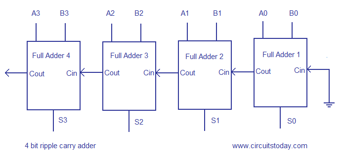
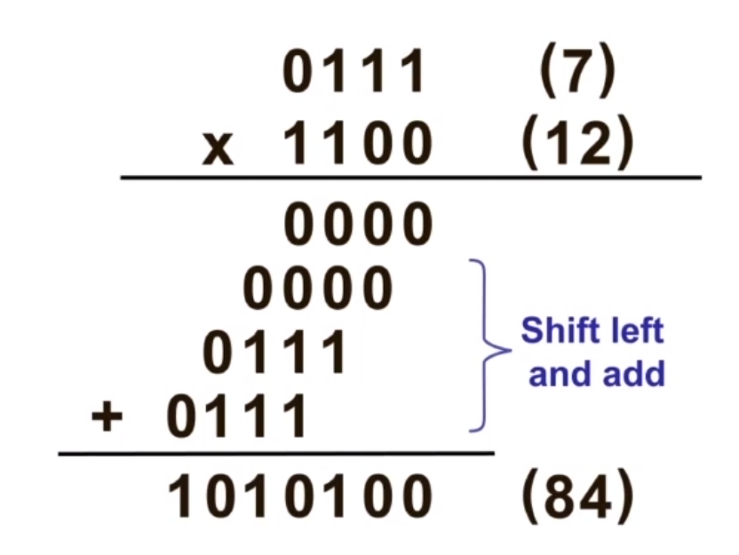
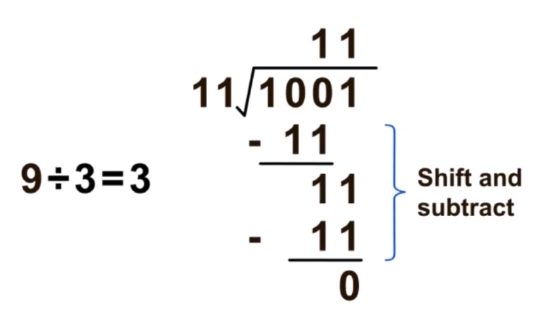

# Digital Arithmetic

Using binary to perform addition, subtraction, multiplication and division

# Addition
- $10111_2 + 1010_2$
    - We can see the second bit requires a carry, hence 10111 + 1010 = 100001

# Adders

### Half adder
- It is a logic circuit that performs the addition of 2 bits
- It takes in a 2 bit input, and has a 2 bit output - a carry and a sum
    - SUM = A ⊕ B
    - Carry = A.B
- A | B | Carry | Sum
  --- | --- | --- | ---
  0 | 0 | 0 | 0
  0 | 1 | 0 | 1
  1 | 0 | 0 | 1
  1 | 1 | 1 | 0 

### Full adder
- A logic circuit that performs addition on 3 bits - A, B and $C_{in}$ (Carry-in)
- It has 2 outputs - $C_{out}$ (Carry-out) and sum
- A | B | Cin | Cout | Sum
  --- | --- | --- | ---
  0 | 0 | 0 | 0 | 0
  0 | 0 | 1 | 0 | 1
  0 | 1 | 0 | 0 | 1
  0 | 1 | 1 | 1 | 0
  1 | 0 | 0 | 0 | 1
  1 | 0 | 1 | 1 | 0
  1 | 1 | 0 | 1 | 0
  1 | 1 | 1 | 1 | 1
- Sum = A ⊕ B ⊕ Cin
- Cout = A.B + B.Cin + A.Cin
- Also, see that Cout = A.B + B.Cin + A.Cin 
    = A.B + (A'B + AB)Cin + (AB + AB')Cin 
    = AB + Cin(AB) + Cin(A'B + AB') 
    = AB(1 + C) + Cin(A'B + AB') 
    = AB + Cin.(A ⊕ B) (Half adder)

- To add 2 4-bit numbers together, we need 4 full adders
    - The first full adder takes 1 bit from the first number, 1 bit from the second number, and nothing for the carry in
    - The second full adder takes the second bit from the first number, the second bit for the second number, and the carry out from the previous adder will be the carry in
    - This goes on until the last adder is reached
    - This configuration is called the **ripple-carry adder**
    - Addition speed is limited by propagation delays of the full adder - called **carry propagration**
    - 

# Signed magnitude representation
- The sign for a binary number is the MSB
- If the sign is 0, it is positive. If it is 1, it is negative
- Decimal number | Sign | Magnitude
  --- | --- | ---
  14 | 0 | 1110
  -14 | 1 | 1110
- An N-bit signed value lies within the range $[-(2^{N-1} - 1), 2^{N-1} - 1]$
    - $1111_2 = -7_{10}, 0111_2 = 7_{10}, 0000_2 = 0_{10}, 1000_2 = -0_{10}$

# 2's complement system
- sign bit = 0 for zero and positive numbers
- sign bit = 1 for negative number
- To get the 2's complement for a number
    1. Invert every bit of the binary number (1's complement)
    2. Add 1 to the result
    E.g. 1110 -> 0001 -> 0010
- Decimal number | Sign | Magnitude
  --- | --- | ---
  14 | 0 | 1110
  -14 | 1 | 0010
- Shortcut for obtaining 2's complement of a number
    1. Starting from LSB, copy the bit if it is '0', and repeat the process with the remaining bits UNTIL THE FIRST 1
    2. Copy the bit if it is the first '1', then invert all the remaining bits
- There is 1 more negative value than positive ones
- An N-bit value in 2's complement lies within the range $[-2^{N-1}, 2^{N-1} - 1]$
    - E.g. in 4 bits, the range of values is [-8, 7] (Note you cannot represent +8 as a value using 4 bits in 2's complement)
    - 8 bits, [-128, 127] (Cannot represent +128 as a value in 8 bits in 2's complement)

# Obtaining a decimal value of a 2's complement number
If number is **positive**
- Perform binary-to-decimal conversion on the number
If number is **negative**
- Use 2's complement to convert to **positive**
- Perform binary-to-decimal conversion on the positive number

E.g. Obtain the decimal equivalent of the following 2's complement numbers
1. 01001
    - 1001 is 9 in decimal
    - Hence 1001 is +9

2. 10011
	- Since the leading bit is 1, it is negative
	- 10011 = 01101 in 2's complement
	- 01101 is an 13
	- Hence the value is -13

### Some observations on the 2's complement number system
- The 2's complement of an N-bit binary number is also of N bits
- To represent a binary number with N significant bits in its magnitude using 2's complement, we require N+1 bits. The extra bit is the sign bit (see exception)
- If there are more bits than necessary to represent a binary number in 2's complement, the more significant bits are filled with the sign bit - this is known as **sign extension**
	- 101 = 1101 = 11101
	- 011 = 0011 = 00011
- 2's complement operation will change a positive number to negative, and vice-versa, with **no change** to the magnitude (see exception)
- (exception) -2^(n-1) in an n-bit 2's complement system. 
	- e.g. -8 in a 4 bit system. Cannot change to +8 using 2's complement due to the lack of bits

# Reasons for using 2's complement
- Subtraction using 2's complement can be carried out the same way as addition
- Therefore the same set of hardware circuits can be used for both subtraction and addition 

# Addition in 2's complement system
1. 10 + 3 (2 positive numbers)
	- 10 + 3 = 13
	- sign | | | |
	--- | --- | --- | --- | ---
	0 | 1 | 0 | 1 | 0
	1 | 1 | 1 | 0 | 1
	0 | 0 |1 | 1 | 1
	- **Ignore** the carry out

2. -10 + 3 (1 negative number)
	- -10 + 3 = -7
	- sign | | | |
	--- | --- | --- | --- | ---
	1 | 0 | 1 | 1 | 0
	0 | 0 | 0 | 1 | 1
	1 | 1 | 0 | 0 | 1
	- 11001 -> 00111 (Convert to 2's complement) -> -7

3. -10 -3 (2 negative numbers)
	- -10 - 3 = -13
	- sign | | | | 
	--- | --- | --- | --- | ---
	1 | 0 | 1 | 1 | 0
	1 | 1 | 1 | 0 | 1
	--- | --- | --- | --- | ---
	1 | 0 | 0 | 1 | 1
	- 10011 -> -13

# Subtraction in 2's complement
- Subtraction is just **negative addition**
- 5 - 3 = 5 + (-3)
- A - B = A + (-B)
- -B = 2's complement of B
- B may be positive or negative

E.g.
- 10 - 3 = 10 + (-3) = 7
	- -3 -> 11101
	- sign | | | |
	--- | --- | --- | --- | ---
	0 | 1 | 0 | 1 | 0
	1 | 1 | 1 | 0 | 1
	0 | 0 | 1 | 1 | 1

- -10 - (-3) = -10 + 3 = -7
- sign | | | |
	--- | --- | --- | --- | ---
	1 | 0 | 1 | 1 | 0
	0 | 0 | 0 | 1 | 1
	1 | 1 | 0 | 0 | 1
- 11001 -> 00111 (Convert to 2's complement) -> -7

# Arithmetic overflow
- Occurs when an arithmetic operation between 2 N-bit operands produces a result that cannot be sufficiently represented by N-bits
- E.g., -4 -5
	- -4 is 1100 in 2's complement
	- -5 is 1011 in 2's complement
	- 1100 + 1011 = 0111 = +7
	- Arithmetic overflow has occurred, resulting in the wrong answer

### Rules to detect overflow in 2's complement
- No overflow occurs if operands have **opposite signs**. Overflow is detected when operands have the **same sign**, but the arithmetic sum has an **opposite sign**
	- sign | | | | |
	--- | --- |--- |--- | --- | ---
	0 | 1 | 0 | 1 | 0
	0 | 1 | 0 | 0 | 0
	1 | 0 | 0 | 1 | 0
	- The sign bit has changed from 0 to 1

- For **subtraction**, no overflow occurs if the operands have the same sign

# Combined circuit for addition and subtraction
.png)
- During addition, the add/sub line is 0. The inputs of y pass through as per normal, and there is no carry in
- During subtraction, the add/sub line is 1. The inputs of y is inverted due to the XOR gate, and there is a carry in. This converts y into its 2's complement to perform subtraction

# Binary multiplication
**Unsigned multiplication** is similar to decimal multiplication

For **2's complement** multiplication
- If the multiplier is positive, same as unsigned multiplication
- If the multiplier is negative, need to take care of the negative weight of the MSB (the sign bit)
- Treat multiplier as a sum of 2 parts
	- MSB: Negative part
	- Remaining bits - positive parts
	- 1011 x 1101 = 1011 x (1000 + 0101) = (1011 x 1000) [Shift and 2's complement] + (1011 x 0101) [Shift and sign extension]
	- -5 x -3 = -5 x (-8 + 5) = -5 x -8 + -5 x 5 = 40 - 25 = 15

# Binary division
**Unsigned division** is similar to long division in decimal arithmetic

For signed division, convert signed numbers to unsigned, perform unsigned division, then convert the result using the appropriate sign representation

# BCD addition
- When the sum of 2 BCD digits does not exceed $9_{10}$, the operation is the same as binary addition
- If the sum of 2 BCD digits is more than $9_{10}$, then a correction needs to be made by **adding 6** to skip over the 6 invalid codes
	- To correct the error,
	- A carry of decimal value 1 is brought forward to the next higher digit
	- The decimal value 6 is added to the sum to obtain the correct BCD digit

e.g. 24 + 47 =71
0010 0100 + 0100 0111 = 0110 1011

We can see that the rightmost digit exceeds 9, hence we do a correction

0110 1011 = (0110 + 0001) (1011 + 0110) = 0111 0001

