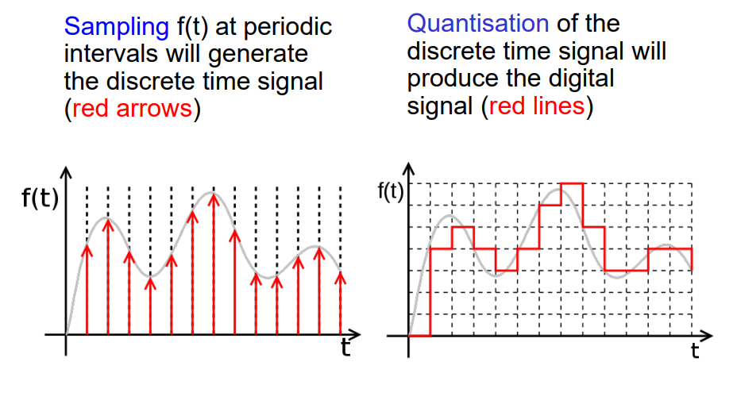

# Introduction

# Analog vs Digital
- Analog quantities are **continuous** quantities, such as 
    - height
    - temperature
    - time
- Digital quantities are **discrete** quantities, such as
    - Number of mods you fail
    - Number of significant others you hate
    - Number of pizzas you can eat in one sitting

A digital quantity changes in **discrete** steps, while an analog quantity changes gradually. Analog quantities can be represented by *sampling* and *quantisation*

# [Quantisation](https://en.wikipedia.org/wiki/Quantization_(signal_processing))
- Quantization, in mathematics and digital signal processing, is the process of mapping input values from a large set (often a continuous set) to output values in a (countable) smaller set, often with a finite number of elements.
- Examples of quantization include **rounding** and **truncation**
- Uses [data binning](https://en.wikipedia.org/wiki/Data_binning). Replaces values within a small interval, with a single specific value representative of the interval. 
    - Values between 0.0 V - 1.0 V replaced by 0, values between 1.0 V - 2.0 V replaced by 1, etc.
    - Precision is lost using quantisation (quantization error), however can be minimised by using smaller intervals
    - An example equation used to quantise an analog signal with a step size $\Delta$ (Mid-tread uniform quantizer)

$$ 
Q(x) = \Delta \lfloor \frac{x}{\Delta} + \frac{1}{2} \rfloor 
$$

Pros | Cons 
--- | ---
More resistant to noise | Most real world quantities are analog in nature, hence conversion is required
Easier to store data |
Easier to design |
High speed, low cost, small size |

# [Sampling](https://en.wikipedia.org/wiki/Sampling_(signal_processing))
- In signal processing, sampling is the reduction of a continuous-time signal to a discrete-time signal. A common example is the conversion of a sound wave (a continuous signal) to a sequence of samples (a discrete-time signal).
- Taking the value of an analog quantity at small intervals
    - Taking the amplitude of a sound wave every 0.001s
- Harder to accurately transmit and reproduce analog signals due to noise and technological limitations

# Digital Data Transmission
- Data can be transmitted either 
    - serially (1 checkout counter at the supermarket)
    - in parallel (32 checkout counters at the supermarket)

- Serial transmission is less complex and is cheaper (less serial lines to transmit data), however requires more time
- Parallel transmission is more complex (due to problems such as [race conditions](https://en.wikipedia.org/wiki/Race_condition)), however can complete quicker

